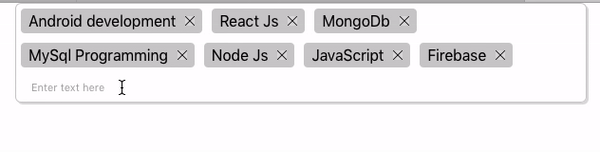

# React-Capsules
A plug &amp; play api for bullet lists in React. 

## React-capsules is now on npm. Visit  [github](https://github.com/Gaurav2048/React-capsules-library) or [npm](https://www.npmjs.com/package/react-capsules)  page to know more. 

# HOW TO USE
Main Components 
1. ReactBulletDnd 
2. ReactBulletDnd.Item
3. ReactBulletDnd.TextInput

 **Style every component as your requirement by passing a style prop to each of them.** 

 **To have drag and drop feature pass the data to ReactBulletDnd component in a data prop and a position prop to ReactBulletDnd.Item. This should be the index of the array.**

 **pass a function to addItem prop to handle enter key pressed event in ReactBulletDnd.TextInput component.** 

# Example : 
 
 Refer /src/App.js. 
 

